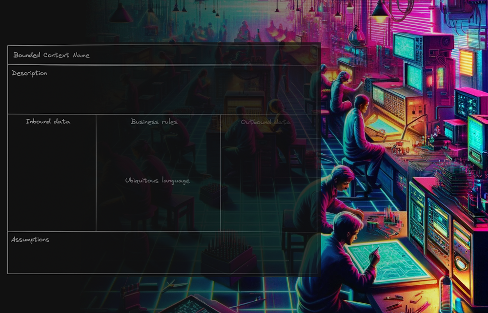

# bounded_context_canvas_md

<div id="top"></div>
<!--
*** Thanks for checking out the Best-README-Template. If you have a suggestion
*** that would make this better, please fork the repo and create a pull request
*** or simply open an issue with the tag "enhancement".
*** Don't forget to give the project a star!
*** Thanks again! Now go create something AMAZING! :D
-->


<!-- PROJECT LOGO -->
<br />
<div align="center">
  <a href="https://github.com/grjsmith/bounded_context_canvas_md
">
    
  </a>

<h1 align="center">Bounded Context Canvas Markdown</h1>

  <p align="center">
    A simplified implementation of the ddd-crew's <a href="https://github.com/ddd-crew/bounded-context-canvas">Bounded Context Canvas</a> using markdown and YAML.
    <br />
    <br />
    <br />
    <a href="https://github.com/grjsmith/bounded_context_canvas_md/issues">Report a bug</a>
    ·
    <a href="https://github.com/grjsmith/bounded_context_canvas_md/issues">Request a feature</a>
  </p>
</div>


<!-- TABLE OF CONTENTS -->
<details>
  <summary>Table of Contents</summary>
  <ol>
    <li>
      <a href="#about-the-project">About The Project</a>
      <ul>
        <li><a href="#built-with">Built With</a></li>
      </ul>
    </li>
    <li>
      <a href="#getting-started">Getting Started</a>
      <ul>
        <li><a href="#prerequisites">Prerequisites</a></li>
      </ul>
    </li>
    <li><a href="#usage">Usage</a></li>
    <!--<li><a href="#roadmap">Roadmap</a></li>-->
    <li><a href="#contributing">Contributing</a></li>
    <li><a href="#license">License</a></li>
    <li><a href="#contact">Contact</a></li>
    <li><a href="#acknowledgments">Acknowledgments</a></li>
  </ol>
</details>

<!-- ABOUT THE PROJECT -->
## About The Project
[Tomek Paczkowski](https://www.linkedin.com/in/tomekpaczkowski/) and I were trying to create some well defined bounded contexts out of a set of existing systems. This had been tried before with workshops and asking questions with little success. Tomek and I came up with the idea of using [Notion](https://notion.so/) and the bounded context canvas on a call with the engineers who ran the service to try and extract the details. We created a the DDD group's bounded contect canvas in Notion and began using Markdown to enter the details. We used Cunningham's Law* to get the engineers to actively contribute and eventually take over the exercise and populate the information for themselves. This not only worked beautifully but it took us less than an hour to get a good first draft of each bounded context.

\* "The best way to get the right answer on the Internet is not to ask a question; it's to post the wrong answer." - [Howard G Cunningham](https://en.wikipedia.org/wiki/Ward_Cunningham#:~:text=%22Cunningham's%20Law%22,-For%20the%20mathematical&text=Cunningham%20is%20credited%20with%20the,than%20to%20answer%20a%20question.)
<p align="right">(<a href="#top">back to top</a>)</p>

### Built With
* The ddd-crew's [Bounded Context Canvas](https://github.com/ddd-crew/bounded-context-canvas).
* We used [Notion](https://notion.so/) because that was the document management tool of choice in Pollen. This could be done in VSCode or any text editor with Markdown support. 

<p align="right">(<a href="#top">back to top</a>)</p>

<!-- GETTING STARTED -->
## Getting Started
### Prerequisites

The only prerequisites required are the courage to look stupid in front of engineers and a willingness to frustrate them a little before they get the hang of it and take over.

<p align="right">(<a href="#top">back to top</a>)</p>

<!-- USAGE EXAMPLES -->
# Bounded Context Canvas Markdown Template

> Created by: *[Insert name here*] Date: *[Insert data here]*

## Name

>*[Insert name of service here]*

## Description

>*[Describe the value service or context provides and how it provides them]*

Note: This is a great opportunity to identify overlaps between services or special cases where a service has been created to handle an edge case that another service didn't cope with. Any findings like these should be added to the assumptions because this service assumes that another service isn't handling those cases.

## Ubiquitous language

>*[Record any context specific domain terminology]*
>
>* *Domain term: Definition_1*
>* *Domain term: Definition_2*
>* *Domain term: Definition_n*

Note: Ubiquitous language doesn't just mean business terms. This is the place where it should be noted that ```variable_name``` doesn't mean the same thing as ```Variable_name``` or ```Variable_Name```.

## Inbound data

### Data provided by other contexts

>*[Describe the data the service is dependent on in order to provide the benefits]*

```yaml
# Data inbound from context1
   key1: value1
     key2: 
       key2a: value2a
       key2b: value2b
     key3: value3
     key4: 
       key4a: value4a
       key4b: value4b
       key4c: value4c
     key5: value5
```

```yaml
# Data inbound from context2
   key1: value1
   List1: ['value2', 'value3', 'value4']
```

Note: This is where the template really starts adding value. This set of inbound dependencies can be shared with the teams that own the services listed and they will then learn how their outputs are consumed by other teams. This can allow a relationship to be created where there wasn't one before and this can allow for forward planning. This also allows teams to run with the template and populate it on their own without support.

### Events consumed

>*List topics the service listens to and the specific events being consumed*
>
>* *topic_name_1*
>   * *topic_name_1_event_1*
>   * *topic_name_1_event_2*
>   * *topic_name_n_event_n*

Note: Events aren't listed because they are particularly different from any other form of data it's more to trigger teams to think of any data state change their service might be listening for but wouldn't normally think about when thinking about inbound data.

## Business rules

> *Describe the logic the service contains. Describe actions it performs when the service receives a `query`, `command` or `event`.*
>
>1. GIVEN `topic_name1_event1` occurs WHEN `key1 = value1` THEN do `action1`

Note: This is where the team can share that when their application performs some function some team somewhere is impacted i.e. When some data is updated the services calculates something and a team somewhere else takes note of that and takes some action. Behaviour Driven Development language isn't necessary but it is concise.

## Outbound Data

```yaml
# Data outbound to context4
    key6: value6
```

## Events published

>*List topics the service listens to and the specific events being consumed*
>
>- *topic_name_2*
>   - *topic_name_2_event_1*
>   - *topic_name_2_event_2*
>   - *topic_name_n_event_n*

## Assumptions

> *List the assumptions made by the service or bounded context itself or made by the team building the service*
>
>* *topic_name1_event1 only occurs when some real world event occurs*

Note: The first time the template is used with the first team these assumptions aren't very helpful. When a few teams have described a few of their services, the assumptions begin to show gaps where people thought something was happening in another team or another service and it isn't or is about to change.

<br />
<p align="right">(<a href="#top">back to top</a>)</p>

<!-- ROADMAP -->
<!--See the [open issues](https://github.com/grjsmith/bounded_context_canvas_md/issues) for a full list of proposed features (and known issues).
<p align="right">(<a href="#top">back to top</a>)</p>-->

<!-- CONTRIBUTING -->
## Contributing
Contributions are what make the open source community such an amazing place to learn, inspire, and create. Any contributions you make are **greatly appreciated**.

If you have a suggestion that would make this better, please fork the repo and create a pull request. You can also simply open an issue with the tag "enhancement".
Don't forget to give the project a star! Thanks again!

1. Fork the Project
2. Create your Feature Branch (`git checkout -b feature/AmazingFeature`)
3. Commit your Changes (`git commit -m 'Add some AmazingFeature'`)
4. Push to the Branch (`git push origin feature/AmazingFeature`)
5. Open a Pull Request

<p align="right">(<a href="#top">back to top</a>)</p>

<!-- LICENSE -->
## License
<a rel="license" href="http://creativecommons.org/licenses/by-sa/4.0/"></a><br />This work is licensed under a <a rel="license" href="http://creativecommons.org/licenses/by-sa/4.0/">Creative Commons Attribution-ShareAlike 4.0 International License</a>.

<p align="right">(<a href="#top">back to top</a>)</p>

<!-- CONTACT -->
## Contact

Grant Smith - [@grjsmith](https://twitter.com/grjsmith) - grant@nextgendevops.com

Project Link: [https://github.com/grjsmith/bounded_context_canvas_md/](https://github.com/grjsmith/bounded_context_canvas_md/)

<p align="right">(<a href="#top">back to top</a>)</p>

<!-- ACKNOWLEDGMENTS -->
## Acknowledgments
* Thanks to the [ddd-crew](https://github.com/ddd-crew/) for their work on the original canvas and on Domain Driven Design.
* Thanks to Eric Evans for his book <a href="https://read.amazon.co.uk/kp/embed?asin=B00794TAUG&preview=newtab&linkCode=kpe&ref_=cm_sw_r_kb_dp_16BE6BZMQ2YDKGR3NMG1">Domain Driven Design.</a>

<p align="right">(<a href="#top">back to top</a>)</p>

<!-- MARKDOWN LINKS & IMAGES -->
<!-- https://www.markdownguide.org/basic-syntax/#reference-style-links -->