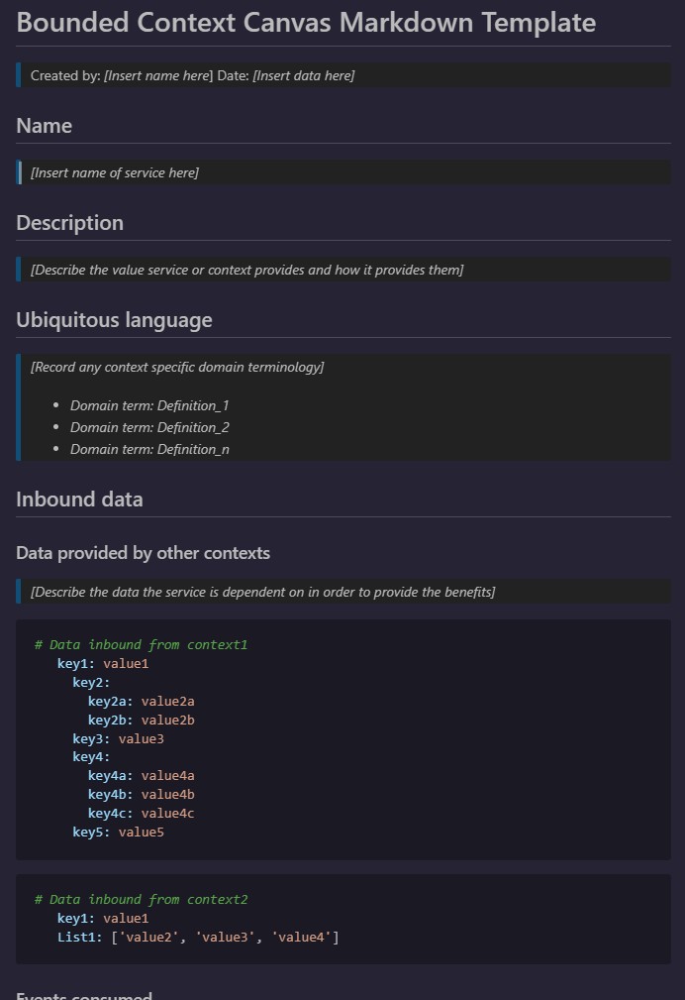

# Bounded context canvas template

A few months ago [Tomek Paczkowski](https://www.linkedin.com/in/tomekpaczkowski/) and I were trying to create some well defined bounded contexts out of a set of existing services. This was a classic situation of a start up that had grown and changed as they needed to and the engineers were struggling to extend their services because they didn't know who was dependent on them and sometimes who they were dependent on in order for their service to keep doing what it was doing. In many cases engineers in different teams had no way of knowing what other team's services were doing at all. There were a few cases where ```variable``` mean something different to ```Variable``` and this all needed to be uncovered if progress was going to be made.

It was decided that the best way to document services was to treat them as bounded contexts and discover what inbound data they were dependent on and what outbound data they produced and the rules that turned one into the other.

The organisation had done some Domain Driven Design work and was familiar with the terminology, which meant engineers were familiar with the context. The difficult thing was creating a process so Tomek and I didn't have to visit every team and interrogate each of them and then to have to go back around when we found inconsistencies.

The organisaiton used [Notion](https://notion.so/) for document management so Tomek and I created a bounded context canvas for a service for a service on a call with the engineers who ran the service to try and extract the details. We used the ddd-crew's [Bounded Context Canvas](https://github.com/ddd-crew/bounded-context-canvas) for inspiration.

We used Cunningham's Law* to get the engineers to actively contribute and eventually take over the exercise and populate the information for themselves. This not only worked beautifully but it took us less than an hour to get a good first draft of each bounded context.

\* "The best way to get the right answer on the Internet is not to ask a question; it's to post the wrong answer." - [Howard G Cunningham](https://en.wikipedia.org/wiki/Ward_Cunningham#:~:text=%22Cunningham's%20Law%22,-For%20the%20mathematical&text=Cunningham%20is%20credited%20with%20the,than%20to%20answer%20a%20question.)

The DDD Crews Bounded Context Canvas template looks like this:


The original is available on the [DDD Crew Github](https://github.com/ddd-crew/bounded-context-canvas).

The template we came up with looks like this:



When we started the meeting Tomek shared his screen and he started building the template on the fly. In this first meeting we had some preconceptions about the service we were discussing so Tomek and I would make some suggestions about how we thought it worked. The team quickly got frustrated with us getting it wrong and they just started modifying the document with what was actually taking place. Less than an hour later we had fully documented the service well enough that we could now use the information to talk to one of the teams with a service upstream.

The next conversation went even faster than the first because we now had some documented facts, in a useful template and the second team could see what was expected of them. It worked really well! I've since used the approach in another, larger organisation with similar problems and it worked just as well again.

So if you want the template and a full README with descriptions about how to get the best from it you can check it out here [https://github.com/ddd-crew/bounded-context-canvas](https://github.com/ddd-crew/bounded-context-canvas). I hope it helps.